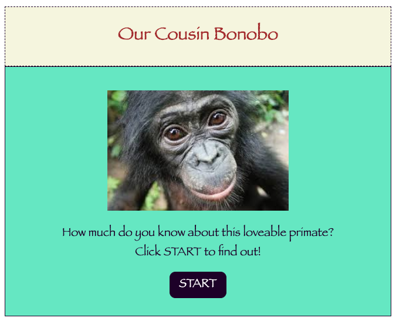

My name is Biz, and I created this app for Thinkful Software Engineering Flex Program.

My Requirements Checklist:

User experience requirements:

The following requirements cover what the app must do, from the user's perspective.

    -The starting screen should have a button that users can click to start the quiz. [check]
    -Users should be prompted through a series of at least 5 multiple choice questions that they can answer. [check]
    -Users should be asked questions 1 after the other. [check]
    -Users should only be prompted with 1 question at a time. [check]
    -Users should not be able to skip questions. [check]
    -Users should also be able to see which question they're on (for instance, "7 out of 10") and their current score ("5 correct, 2 incorrect"). [check]

    -Upon submitting an answer, users should:
        -receive textual feedback about their answer. If they were incorrect, they should be told the correct answer. [check]
        -be moved onto the next question (or interact with an element to move on). [check]

    -Users should be shown their overall score at the end of the quiz. In other words, how many questions they got right out of the total questions asked. [check]
    -Users should be able to start a new quiz. [check]

Technical Requirements:

Your quiz app must:

    -Include a render() function, that conditionally regenerates the view each time the store is updated. [check]
    -Include single-purpose template generation functions. [check]
    -Include single-purpose event handler functions. [check]
    -Call all functions from a jQuery initializing function. [check]
    -NOT add additional HTML elements to the boilerplate code's index.html file (you may add attributes, e.g., classes and ids, to the existing HTML elements, or link stylesheets or additional scripts if necessary). [check]
    -Render answer choices in a <form>. [check]
    -Use semantic HTML, along with CSS and jQuery. [check]
    -Follow a11y best practices. [check]
    -Be fully usable by keyboard (which will be easy enough if you start with a form). [check]
    -Use responsive design.
    -Refer back to the previous checkpoints on responsive design and forms for any help with the HTML/CSS materials.

Process requirements
Before you dive into the app, you'll need to:

    -gather content for your app. That means typing up the questions you'll ask and gathering any images or icons you'll need. [check]
    -think about the user experiences outlined above and how your design must make them possible. [check]
    -design your app using HTML wireframes, which are HTML- (and minimal CSS-) only versions of the different screens in your app. [check]